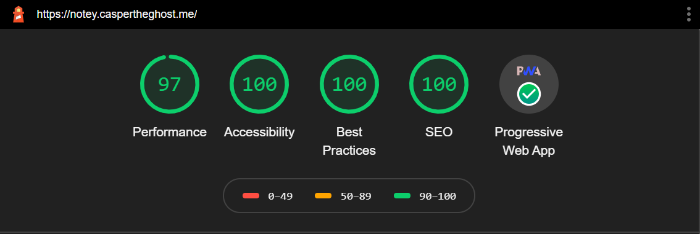
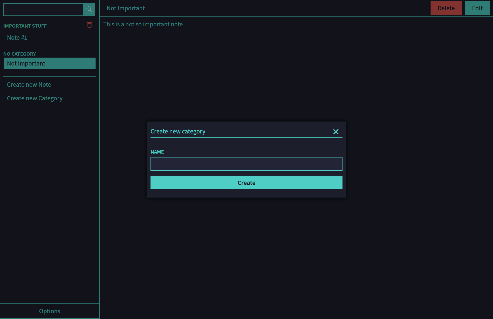

# 📝 Notey.app

Simple notes app to keep track of important things

## ⚡ Features

- Create unlimited notes
- Categorize notes by a category
- Edit notes
- More soon

## Performance and pwa

## 📷 Screenshots

    
View screenshots

### Sign in & Register

### Create note modal

### Create new category

### Main app

## 📃 Docs

[View project board](https://github.com/Dev-CasperTheGhost/notey.app/projects/1)

[View Docs](docs/README.md)

## What I learned

- Better understanding of React functional components
- Better understanding of react hooks
- Authentication in react
- convert text to markdown using [marked](https://www.npmjs.com/package/marked)
